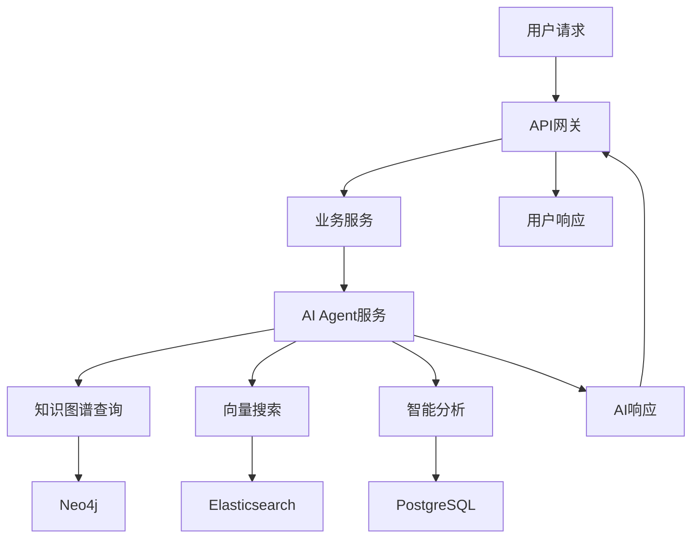

# 百夫长智能管理系统 - Centurion Intelligence Management System

基于微服务架构的智能管理系统，集成AI Agent、知识图谱和向量数据库，提供智能客服、数据分析和风险评估等功能。专为企业级订单支付管理而设计。

## 🏗️ 系统架构 (微服务独立模型)

```
┌─────────────────┐    ┌─────────────────┐    ┌─────────────────┐
│   前端应用      │    │   移动端应用    │    │   第三方系统    │
└─────────┬───────┘    └─────────┬───────┘    └─────────┬───────┘
          │                      │                      │
          └──────────────────────┼──────────────────────┘
                                 │
                    ┌─────────────┴─────────────┐
                    │      API 网关             │
                    │ (认证、限流、路由、独立模型) │
                    └─────────────┬─────────────┘
                                 │
          ┌──────────────────────┼──────────────────────┐
          │                      │                      │
┌─────────┴───────┐    ┌─────────┴───────┐    ┌─────────┴───────┐
│   订单服务      │    │   支付服务      │    │   发货服务      │
│ (Order Service) │    │(Payment Service)│    │(Shipping Service)│
│   独立数据模型   │    │   独立数据模型   │    │   独立数据模型   │
└─────────────────┘    └─────────────────┘    └─────────────────┘
          │                      │                      │
          └──────────────────────┼──────────────────────┘
                                 │
        ┌─────────────┬─────────────┴─────────────┬─────────────┐
        │             │                           │             │
┌───────┴───────┐ ┌───┴────┐              ┌──────┴──────┐ ┌────┴────┐
│ AI Agent服务  │ │任务调度│              │  共享工具层  │ │基础设施层│
│(智能客服分析) │ │  服务  │              │(配置/工具函数)│ │数据库集群│
│  独立数据模型  │ │独立模型│              │   shared/   │ │  存储层 │
└───────────────┘ └────────┘              └─────────────┘ └─────────┘
```

## 📁 项目结构 (微服务独立模型架构)

```
centurion-intelligence-mgmt/
├── 🔗 api-gateway/                 # API网关服务
│   └── app/
│       ├── models.py              # ✨ 独立响应模型
│       └── routers/
├── 📦 order-service/              # 订单服务  
│   └── app/
│       ├── models.py              # ✨ 订单业务模型
│       ├── services.py            # 业务逻辑
│       └── routers/
├── 💳 payment-service/            # 支付服务
│   └── app/
│       ├── models.py              # ✨ 支付业务模型
│       ├── services.py            # 支付逻辑
│       └── routers/
├── 🚚 shipping-service/           # 发货服务
│   └── app/
│       ├── models.py              # ✨ 发货&资产模型
│       ├── services.py            # 发货逻辑
│       └── routers/
├── 🤖 ai-agent-service/           # AI智能服务
│   └── app/
│       ├── models.py              # ✨ AI响应模型
│       ├── services/              # AI核心服务
│       └── routers/
├── ⏰ task-scheduler-service/      # 任务调度服务
│   └── app/
│       ├── models.py              # ✨ 调度模型
│       └── services/
├── 🔧 shared/                     # 共享工具层
│   ├── config.py                  # 配置管理
│   ├── utils.py                   # 工具函数
│   └── __init__.py
├── 🐳 docker-compose/             # 容器编排
├── 📚 docs/                       # 文档目录
├── 🔧 scripts/                    # 脚本工具
├── 📋 MODELS_MIGRATION_SUMMARY.md # ✨ 模型迁移文档
└── 📖 README.md                   # 项目说明
```

## 🚀 核心功能

### 订单服务 (Order Service)
- 订单创建、查询、更新
- 订单状态管理
- 用户订单历史
- 订单取消功能
- **🤖 AI集成**: 自动构建订单知识图谱

### 支付服务 (Payment Service)
- 多种支付方式支持（支付宝、微信、模拟支付）
- 支付状态跟踪
- 退款处理
- 支付回调处理
- **🤖 AI集成**: 支付风险评估

### 发货服务 (Shipping Service)
- 调用第三方发货系统
- 发货状态同步
- 快递单号管理
- 发货订单取消
- **🤖 AI集成**: 智能物流优化

### AI Agent服务 (AI Agent Service) 🆕
- **🧠 智能客服**: 基于向量搜索的问答系统
- **🕸️ 知识图谱**: 订单、用户、商品关系建模
- **🔍 向量搜索**: 文档相似度搜索和推荐
- **📊 数据分析**: 用户行为模式分析
- **⚠️ 风险评估**: 订单风险智能评估
- **💬 对话管理**: 多轮对话上下文管理

### API网关 (API Gateway)
- 统一入口管理
- JWT认证
- 请求限流
- 路由转发
- 日志记录
- **🤖 AI路由**: AI服务统一接入

## 🛠️ 技术栈

### 核心框架
- **后端框架**: FastAPI
- **数据模型**: Pydantic (各服务独立模型)
- **数据库**: PostgreSQL 15
- **缓存**: Redis
- **消息队列**: RabbitMQ

### AI & 数据科学
- **知识图谱**: Neo4j + NetworkX
- **向量数据库**: Elasticsearch + ChromaDB
- **机器学习**: scikit-learn + transformers
- **向量嵌入**: sentence-transformers
- **自然语言处理**: spaCy + jieba

### 微服务架构
- **服务治理**: 独立数据模型 + 共享工具层
- **类型系统**: 严格类型检查 (Dict[str, Any])
- **API契约**: OpenAPI规范保证服务间兼容性
- **容器化**: Docker + Docker Compose
- **认证**: JWT
- **文档**: Swagger/OpenAPI 自动生成

## 🎯 AI功能详解

### 1. 知识图谱 (Knowledge Graph)
```python
# 节点类型
- User: 用户节点
- Order: 订单节点  
- Product: 商品节点
- Payment: 支付节点
- Shipping: 发货节点

# 关系类型
- belongs_to: 订单属于用户
- contains: 订单包含商品
- paid_by: 订单通过支付方式付款
- shipped_via: 订单通过物流发货
```

### 2. 向量搜索 (Vector Search)
```python
# 文档类型
- FAQ: 常见问题
- Policy: 政策文档
- Manual: 操作手册
- Product: 商品描述

# 搜索能力
- 语义相似度搜索
- 多语言支持
- 实时索引更新
```

### 3. 智能对话 (Intelligent Chat)
```python
# 对话类型
- customer_service: 客服对话
- order_inquiry: 订单咨询
- payment_support: 支付支持
- technical_help: 技术帮助

# AI能力
- 上下文理解
- 意图识别
- 知识检索
- 个性化回复
```

## 🚀 快速开始

### 1. 环境准备

确保已安装以下软件：
- Python 3.11+
- Docker & Docker Compose
- Git

### 2. 克隆项目

```bash
git clone <repository-url>
cd centurion-intelligence-mgmt
```

### 3. 环境配置

```bash
# 复制环境变量配置文件
cp .env.example .env

# 根据实际情况修改 .env 文件中的配置
# 特别注意AI相关配置：
# - OPENAI_API_KEY: OpenAI API密钥
# - NEO4J_PASSWORD: Neo4j数据库密码

# 验证模型迁移状态
ls -la */app/models.py
# 应该看到每个服务都有独立的 models.py 文件
```

### 4. 使用Docker Compose启动

```bash
# 进入docker-compose目录
cd docker-compose

# 启动所有服务（包括AI服务）
docker-compose up -d

# 查看服务状态
docker-compose ps

# 查看日志
docker-compose logs -f ai-agent-service
```

### 5. 验证模型架构

```bash
# 检查各服务的独立模型文件
echo "=== 验证独立模型文件 ==="
find . -name "models.py" -path "*/app/*" | head -10

# 验证服务启动状态
docker-compose ps

# 检查API文档中的模型定义
echo "=== 订单服务模型 ==="
curl -s http://localhost:8001/openapi.json | grep -o '"OrderStatus"'

echo "=== 支付服务模型 ==="  
curl -s http://localhost:8002/openapi.json | grep -o '"PaymentStatus"'
```

### 6. 初始化AI数据

```bash
# 添加示例FAQ文档
curl -X POST "http://localhost:8004/api/v1/vector/documents/" \
  -H "Content-Type: application/json" \
  -d '{
    "document_type": "faq",
    "title": "如何查询订单状态？",
    "content": "您可以通过订单号在我的订单页面查询订单状态，或联系客服获取帮助。",
    "tags": ["订单", "查询", "状态"]
  }'

# 创建聊天会话
curl -X POST "http://localhost:8004/api/v1/chat/sessions/" \
  -H "Content-Type: application/json" \
  -d '{
    "user_id": "user_001",
    "session_type": "customer_service"
  }'
```

## 📡 API文档

启动服务后，可以访问以下地址查看API文档：

- **API网关**: http://localhost:8000/docs
- **订单服务**: http://localhost:8001/docs
- **支付服务**: http://localhost:8002/docs
- **发货服务**: http://localhost:8003/docs
- **🆕 AI Agent服务**: http://localhost:8004/docs

## 🌐 服务端口

| 服务 | 端口 | 说明 |
|------|------|------|
| API网关 | 8000 | 统一入口 |
| 订单服务 | 8001 | 订单管理 |
| 支付服务 | 8002 | 支付处理 |
| 发货服务 | 8003 | 发货管理 |
| **🆕 AI Agent服务** | **8004** | **AI智能服务** |
| PostgreSQL | 5432 | 主数据库 |
| Redis | 6379 | 缓存 |
| RabbitMQ | 5672/15672 | 消息队列 |
| **🆕 Neo4j** | **7474/7687** | **知识图谱** |
| **🆕 Elasticsearch** | **9200** | **向量搜索** |

## 🤖 AI功能使用示例

### 1. 智能客服对话

```bash
# 创建聊天会话
curl -X POST "http://localhost:8000/api/v1/chat/sessions/" \
  -H "Content-Type: application/json" \
  -d '{"user_id": "user_001"}'

# 发送消息
curl -X POST "http://localhost:8000/api/v1/chat/message/" \
  -H "Content-Type: application/json" \
  -d '{
    "session_id": "<session-id>",
    "message": "我的订单什么时候发货？"
  }'
```

### 2. 知识图谱查询

```bash
# 构建订单知识图谱
curl -X POST "http://localhost:8000/api/v1/knowledge/build/order" \
  -H "Content-Type: application/json" \
  -d '{
    "id": "ORD20241028001",
    "user_id": "user_001",
    "items": [{"product_id": "prod_001", "product_name": "商品1"}],
    "total_amount": 199.98
  }'

# 查询相关节点
curl "http://localhost:8000/api/v1/knowledge/nodes/user_001/related?relation_types=belongs_to"
```

### 3. 向量搜索

```bash
# 搜索相关文档
curl -X POST "http://localhost:8000/api/v1/vector/search/" \
  -H "Content-Type: application/json" \
  -d '{
    "query": "订单退款流程",
    "document_types": ["faq", "policy"],
    "limit": 3
  }'
```

### 4. 风险评估

```bash
# 订单风险评估
curl -X POST "http://localhost:8000/api/v1/chat/assess/risk" \
  -H "Content-Type: application/json" \
  -d '{
    "order_data": {
      "id": "ORD20241028001",
      "user_id": "user_001",
      "total_amount": 15000,
      "items": [...]
    }
  }'
```

## 🗄️ 数据库说明

### PostgreSQL (主数据库)
- **版本**: PostgreSQL 15
- **用途**: 存储业务数据和AI训练数据
- **特性**: JSONB支持、全文搜索、时区处理

### Neo4j (知识图谱)
- **版本**: Neo4j 5.14
- **用途**: 存储实体关系和知识图谱
- **访问**: http://localhost:7474 (neo4j/password)

### Elasticsearch (向量搜索)
- **版本**: Elasticsearch 8.11
- **用途**: 文档向量化存储和相似度搜索
- **访问**: http://localhost:9200

## 📊 AI数据流



## 🔧 开发指南

### AI服务扩展

1. **添加新的向量文档类型**:
```python
# 在 VectorSearchService 中添加新类型
await service.add_document(
    document_type="new_type",
    title="标题",
    content="内容",
    metadata={"category": "新分类"}
)
```

2. **扩展知识图谱节点**:
```python
# 在 KnowledgeGraphService 中添加新节点类型
await service.create_node(
    node_type="new_entity",
    entity_id="entity_001",
    name="实体名称",
    properties={"attr1": "value1"}
)
```

3. **自定义对话逻辑**:
```python
# 在 ChatService 中扩展 _generate_rule_based_response
# 添加新的意图识别和回复逻辑
```

### 性能优化

1. **向量索引优化**:
   - 使用适当的向量维度
   - 定期重建索引
   - 批量插入优化

2. **知识图谱优化**:
   - 合理设计节点和关系
   - 使用索引加速查询
   - 定期清理冗余数据

3. **缓存策略**:
   - 缓存热门查询结果
   - 使用Redis存储会话状态
   - 预计算常用分析结果

## 🚀 部署

### 生产环境配置

```bash
# 更新环境变量
export OPENAI_API_KEY="your-production-api-key"
export NEO4J_PASSWORD="secure-password"
export JWT_SECRET_KEY="production-secret-key"

# 启动生产环境
docker-compose -f docker-compose.prod.yml up -d
```

### 监控和维护

- **应用监控**: Prometheus + Grafana
- **日志聚合**: ELK Stack
- **AI模型监控**: MLflow
- **数据备份**: 定期备份PostgreSQL和Neo4j

