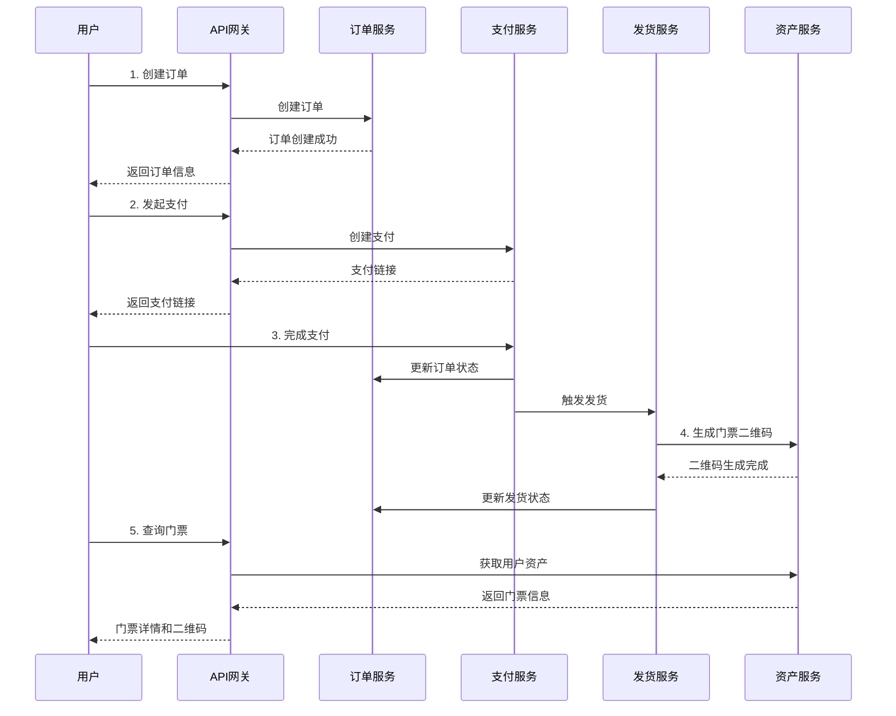
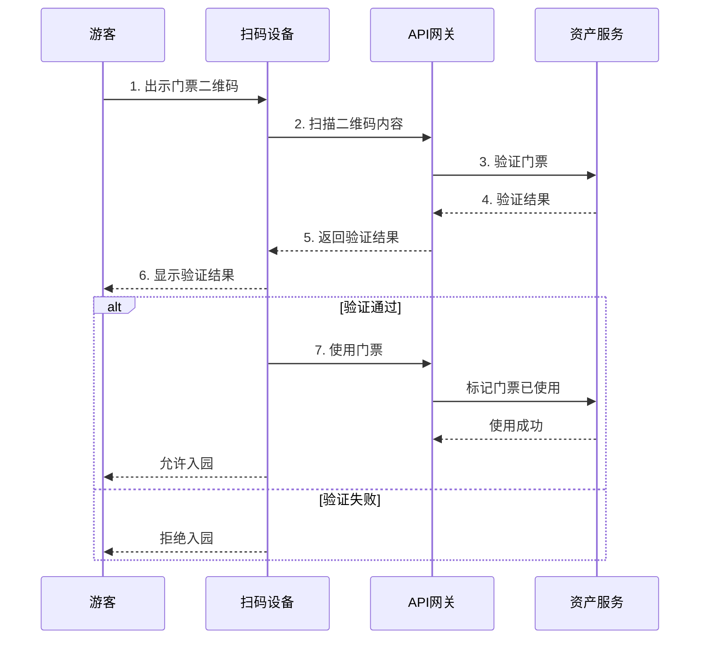

# API接口文档

## 概述

本文档详细描述了订单支付系统的API接口，包括门票二维码生成、用户资产管理等新功能。

## 基础信息

- **API版本**: v1
- **基础URL**: `https://api.yourdomain.com/api/v1`
- **认证方式**: JWT Bearer Token
- **响应格式**: JSON

## 通用响应格式

```json
{
  "success": true,
  "message": "操作成功",
  "data": {},
  "error_code": null
}
```

## 1. 订单服务 API

### 1.1 创建订单

**接口**: `POST /orders/`

**描述**: 创建新订单，支持门票和实物商品

**请求体**:
```json
{
  "user_id": "user_001",
  "items": [
    {
      "product_id": "ticket_001",
      "product_name": "黄山风景区门票",
      "product_type": "ticket",
      "quantity": 2,
      "unit_price": 190.0,
      "total_price": 380.0,
      "scenic_area_id": "huangshan_001",
      "scenic_area_name": "黄山风景区",
      "valid_days": 30,
      "ticket_type": "成人票"
    }
  ],
  "shipping_address": "安徽省黄山市",
  "phone": "13800138000",
  "notes": "请尽快发货"
}
```

**响应**:
```json
{
  "success": true,
  "message": "订单创建成功",
  "data": {
    "id": "ORD20241030001",
    "user_id": "user_001",
    "total_amount": 380.0,
    "status": "pending",
    "created_at": "2024-10-30T15:30:00Z"
  }
}
```

### 1.2 查询订单

**接口**: `GET /orders/{order_id}`

**描述**: 根据订单ID查询订单详情

**响应**:
```json
{
  "success": true,
  "message": "获取订单成功",
  "data": {
    "id": "ORD20241030001",
    "user_id": "user_001",
    "items": [...],
    "total_amount": 380.0,
    "status": "paid",
    "shipping_address": "安徽省黄山市",
    "phone": "13800138000",
    "created_at": "2024-10-30T15:30:00Z",
    "updated_at": "2024-10-30T15:35:00Z"
  }
}
```

### 1.3 获取用户订单列表

**接口**: `GET /orders/user/{user_id}`

**参数**:
- `status`: 订单状态筛选 (可选)
- `page`: 页码，默认1
- `page_size`: 每页数量，默认20

## 2. 支付服务 API

### 2.1 创建支付

**接口**: `POST /payments/`

**请求体**:
```json
{
  "order_id": "ORD20241030001",
  "amount": 380.0,
  "payment_method": "alipay"
}
```

**响应**:
```json
{
  "success": true,
  "message": "支付创建成功",
  "data": {
    "id": "PAY20241030001",
    "order_id": "ORD20241030001",
    "amount": 380.0,
    "payment_method": "alipay",
    "status": "pending",
    "payment_url": "https://openapi.alipay.com/gateway.do?..."
  }
}
```

### 2.2 查询支付状态

**接口**: `GET /payments/{payment_id}`

**响应**:
```json
{
  "success": true,
  "message": "获取支付信息成功",
  "data": {
    "id": "PAY20241030001",
    "order_id": "ORD20241030001",
    "amount": 380.0,
    "payment_method": "alipay",
    "status": "success",
    "transaction_id": "2024103022001234567890",
    "created_at": "2024-10-30T15:35:00Z"
  }
}
```

## 3. 发货服务 API

### 3.1 创建发货

**接口**: `POST /shipping/`

**描述**: 创建发货记录，系统会根据商品类型自动处理（门票生成二维码，实物调用第三方发货）

**请求体**:
```json
{
  "order_id": "ORD20241030001",
  "shipping_address": "安徽省黄山市",
  "phone": "13800138000",
  "recipient_name": "张三"
}
```

**响应**:
```json
{
  "success": true,
  "message": "发货记录创建成功，正在处理发货",
  "data": {
    "id": "SHP20241030001",
    "order_id": "ORD20241030001",
    "status": "pending",
    "created_at": "2024-10-30T15:40:00Z"
  }
}
```

### 3.2 查询发货状态

**接口**: `GET /shipping/{shipping_id}`

**响应**:
```json
{
  "success": true,
  "message": "获取发货记录成功",
  "data": {
    "id": "SHP20241030001",
    "order_id": "ORD20241030001",
    "status": "shipped",
    "tracking_number": "SF1234567890",
    "carrier": "顺丰速运",
    "shipped_at": "2024-10-30T15:45:00Z"
  }
}
```

## 4. 用户资产管理 API 🆕

### 4.1 获取用户资产列表

**接口**: `GET /assets/user/{user_id}`

**描述**: 获取用户的所有资产（门票、代金券等）

**参数**:
- `asset_type`: 资产类型筛选 (ticket, voucher, membership, points, physical)
- `page`: 页码，默认1
- `page_size`: 每页数量，默认20

**响应**:
```json
{
  "success": true,
  "message": "获取用户资产成功",
  "data": {
    "assets": [
      {
        "id": "TICKET_20241030001",
        "user_id": "user_001",
        "asset_type": "ticket",
        "asset_name": "黄山风景区 - 成人票",
        "asset_code": "{\"type\":\"ticket\",\"ticket_id\":\"TICKET_20241030001\",...}",
        "qr_code_url": "https://qr.yourdomain.com/qr/TICKET_20241030001.png",
        "order_id": "ORD20241030001",
        "status": "active",
        "metadata": {
          "scenic_area_id": "huangshan_001",
          "scenic_area_name": "黄山风景区",
          "ticket_type": "成人票",
          "unit_price": 190.0
        },
        "valid_from": "2024-10-30T15:45:00Z",
        "valid_until": "2024-11-29T23:59:59Z",
        "created_at": "2024-10-30T15:45:00Z"
      }
    ],
    "total": 2,
    "page": 1,
    "page_size": 20,
    "total_pages": 1
  }
}
```

### 4.2 根据二维码获取资产

**接口**: `GET /assets/code/{asset_code}`

**描述**: 通过扫描二维码获取资产详情

**响应**:
```json
{
  "success": true,
  "message": "获取资产详情成功",
  "data": {
    "id": "TICKET_20241030001",
    "asset_name": "黄山风景区 - 成人票",
    "asset_type": "ticket",
    "status": "active",
    "metadata": {
      "scenic_area_name": "黄山风景区",
      "ticket_type": "成人票"
    },
    "valid_from": "2024-10-30T15:45:00Z",
    "valid_until": "2024-11-29T23:59:59Z"
  }
}
```

### 4.3 使用资产

**接口**: `POST /assets/{asset_id}/use`

**描述**: 使用资产（如验票入园）

**响应**:
```json
{
  "success": true,
  "message": "资产使用成功"
}
```

### 4.4 获取用户门票列表

**接口**: `GET /assets/tickets/user/{user_id}`

**描述**: 专门获取用户的门票资产

**参数**:
- `status_filter`: 状态筛选 (active, used, expired)
- `scenic_area_id`: 景区ID筛选

**响应**:
```json
{
  "success": true,
  "message": "获取用户门票成功",
  "data": {
    "tickets": [
      {
        "id": "TICKET_20241030001",
        "asset_name": "黄山风景区 - 成人票",
        "qr_code_url": "https://qr.yourdomain.com/qr/TICKET_20241030001.png",
        "status": "active",
        "metadata": {
          "scenic_area_name": "黄山风景区",
          "ticket_type": "成人票"
        },
        "valid_until": "2024-11-29T23:59:59Z"
      }
    ],
    "total": 1
  }
}
```

### 4.5 验证门票

**接口**: `POST /assets/tickets/{ticket_id}/validate`

**描述**: 验证门票有效性（景区入园验证）

**响应**:
```json
{
  "success": true,
  "message": "门票验证通过",
  "data": {
    "ticket_id": "TICKET_20241030001",
    "ticket_name": "黄山风景区 - 成人票",
    "scenic_area": "黄山风景区",
    "ticket_type": "成人票",
    "valid_until": "2024-11-29T23:59:59Z",
    "can_use": true
  }
}
```

## 5. 错误码说明

| 错误码 | 说明 |
|--------|------|
| ORDER_NOT_FOUND | 订单不存在 |
| PAYMENT_FAILED | 支付失败 |
| SHIPPING_FAILED | 发货失败 |
| ASSET_NOT_FOUND | 资产不存在 |
| ASSET_USE_FAILED | 资产使用失败 |
| TICKET_NOT_FOUND | 门票不存在 |
| TICKET_INVALID_STATUS | 门票状态无效 |
| TICKET_EXPIRED | 门票已过期 |
| TICKET_NOT_ACTIVE | 门票尚未生效 |
| INSUFFICIENT_PERMISSIONS | 权限不足 |
| INVALID_PARAMETERS | 参数无效 |

## 6. 业务流程示例

### 6.1 门票购买流程



### 6.2 门票使用流程



## 7. SDK和示例代码

### 7.1 Python SDK示例

```python
import httpx
import asyncio

class OrderPaymentClient:
    def __init__(self, base_url: str, api_key: str):
        self.base_url = base_url
        self.headers = {
            "Authorization": f"Bearer {api_key}",
            "Content-Type": "application/json"
        }
    
    async def create_order(self, order_data: dict):
        """创建订单"""
        async with httpx.AsyncClient() as client:
            response = await client.post(
                f"{self.base_url}/api/v1/orders/",
                json=order_data,
                headers=self.headers
            )
            return response.json()
    
    async def get_user_tickets(self, user_id: str):
        """获取用户门票"""
        async with httpx.AsyncClient() as client:
            response = await client.get(
                f"{self.base_url}/api/v1/assets/tickets/user/{user_id}",
                headers=self.headers
            )
            return response.json()
    
    async def validate_ticket(self, ticket_id: str):
        """验证门票"""
        async with httpx.AsyncClient() as client:
            response = await client.post(
                f"{self.base_url}/api/v1/assets/tickets/{ticket_id}/validate",
                headers=self.headers
            )
            return response.json()

# 使用示例
async def main():
    client = OrderPaymentClient(
        base_url="https://api.yourdomain.com",
        api_key="your-api-key"
    )
    
    # 创建门票订单
    order_data = {
        "user_id": "user_001",
        "items": [{
            "product_id": "ticket_001",
            "product_name": "黄山风景区门票",
            "product_type": "ticket",
            "quantity": 1,
            "unit_price": 190.0,
            "total_price": 190.0,
            "scenic_area_id": "huangshan_001",
            "scenic_area_name": "黄山风景区",
            "valid_days": 30,
            "ticket_type": "成人票"
        }],
        "shipping_address": "安徽省黄山市",
        "phone": "13800138000"
    }
    
    result = await client.create_order(order_data)
    print("订单创建结果:", result)
    
    # 获取用户门票
    tickets = await client.get_user_tickets("user_001")
    print("用户门票:", tickets)

if __name__ == "__main__":
    asyncio.run(main())
```

### 7.2 JavaScript SDK示例

```javascript
class OrderPaymentClient {
    constructor(baseUrl, apiKey) {
        this.baseUrl = baseUrl;
        this.headers = {
            'Authorization': `Bearer ${apiKey}`,
            'Content-Type': 'application/json'
        };
    }

    async createOrder(orderData) {
        const response = await fetch(`${this.baseUrl}/api/v1/orders/`, {
            method: 'POST',
            headers: this.headers,
            body: JSON.stringify(orderData)
        });
        return response.json();
    }

    async getUserTickets(userId) {
        const response = await fetch(
            `${this.baseUrl}/api/v1/assets/tickets/user/${userId}`,
            { headers: this.headers }
        );
        return response.json();
    }

    async validateTicket(ticketId) {
        const response = await fetch(
            `${this.baseUrl}/api/v1/assets/tickets/${ticketId}/validate`,
            { method: 'POST', headers: this.headers }
        );
        return response.json();
    }
}

// 使用示例
const client = new OrderPaymentClient(
    'https://api.yourdomain.com',
    'your-api-key'
);

// 创建订单
client.createOrder({
    user_id: 'user_001',
    items: [{
        product_id: 'ticket_001',
        product_name: '黄山风景区门票',
        product_type: 'ticket',
        quantity: 1,
        unit_price: 190.0,
        total_price: 190.0,
        scenic_area_id: 'huangshan_001',
        scenic_area_name: '黄山风景区',
        valid_days: 30,
        ticket_type: '成人票'
    }],
    shipping_address: '安徽省黄山市',
    phone: '13800138000'
}).then(result => {
    console.log('订单创建结果:', result);
});
```

## 8. 测试环境

- **测试环境URL**: `https://test-api.yourdomain.com`
- **文档地址**: `https://test-api.yourdomain.com/docs`
- **测试账号**: 请联系开发团队获取

## 9. 版本更新记录

### v1.1.0 (2024-10-30)
- ✨ 新增门票二维码生成功能
- ✨ 新增用户资产管理系统
- ✨ 支持多种资产类型（门票、代金券、会员卡等）
- ✨ 新增门票验证接口
- 🐛 修复支付回调处理问题
- 📝 完善API文档

### v1.0.0 (2024-10-28)
- 🎉 初始版本发布
- ✨ 订单管理功能
- ✨ 支付处理功能
- ✨ 发货管理功能
- ✨ API网关集成

## 10. 联系方式

- **技术支持**: tech-support@yourdomain.com
- **API问题**: api-support@yourdomain.com
- **紧急联系**: +86-400-xxx-xxxx

---

**注意**: 本文档持续更新中，如有疑问请及时联系开发团队。